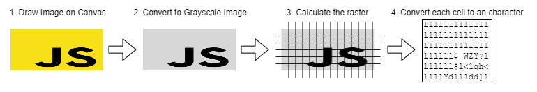

# Exercise 07

## Ascii Image Creation Algorithmn

The ascii image creation algorithmn is split into different phases to prepare the image. 



1. In the first phase, the image is darwn to a canvas and adopt the size of the image.
2. The image on the canvas is in the next step converted into a gray scale image.
3. In the next step, the image is splitted into small cells. The number of cells defines the resolution of the ascii image. A cell can contains of one to many pixels.
4. For each cell, the gray scale number is calcuated between 0 and 255 (if the cell contains only of one pixel, you can directly use the pixel value). This value is used to find the corresponding character in the gray ramp list. The gray ramp list is a collection of characters with a different black pixel ratio.

Gray Ramp Charactor List:
```
const grayRamp = '$@B%8&WM#*oahkbdpqwmZO0QLCJUYXzcvunxrjft/|()1{}[]?-_+~<>i!lI;:,"^`\'. ';
```

## Exercise Steps:
* Implement  function uploadImage() in index.js and register on submit listener

```
  function uploadImage(event) {
  event.preventDefault();

  const username = document.getElementById("username");
  const fileInput = document.getElementById('imageInput');

  const file = fileInput.files.item(0);
  const name = username.value;

  username.value = "";
  fileInput.value = "";

  const canvas = document.getElementById("preview");
  convertImageToAscii(file, canvas, (result) => {
      // TODO implement later
  });
}
```

```
  document.getElementById("uploadImageForm").onsubmit = uploadImage;
```

* Implement function to generate grayscal image and afterwards transform it into an ascii image


```
function convertImageToAscii(file, canvas, callback) {
    const reader = new FileReader();
    reader.onload = (event) => {
        const image = new Image();
        image.onload = () => {

            const [width, height] = clampDimensions(image.width, image.height);

            canvas.width = width;
            canvas.height = height;

            ctx = canvas.getContext('2d');
            ctx.drawImage(image, 0, 0, width, height);

            const grayScales = convertToGrayScales(ctx, width, height);

            const result = generateAscii(grayScales, width);
            //console.log(result)
            callback(result);
        }
        //console.log(event.target.result);
        image.src = event.target.result;
    };

    reader.readAsDataURL(file);
};

```

```
function convertToGrayScales(context, width, height) {
    const imageData = context.getImageData(0, 0, width, height);

    const grayScales = [];

    for (let i = 0; i < imageData.data.length; i += 4) {
        const r = imageData.data[i];
        const g = imageData.data[i + 1];
        const b = imageData.data[i + 2];

        const grayScale = toGrayScale(r, g, b);
        imageData.data[i] = grayScale;
        imageData.data[i + 1] = grayScale;
        imageData.data[i + 2] = grayScale;

        grayScales.push(grayScale);
    }

    context.putImageData(imageData, 0, 0);

    return grayScales;
};

```

* Add saveImage() method to storage class and call it after genereting the ascii image. After storing the new image, the gallery need to be 

```
saveImage(data) {
    //validate input data

    const images = this.loadImages();
    images.unshift(data);

    this.saveImages(images);
}
```

```
function uploadImage(event) {
  
  ...

  convertImageToAscii(file, canvas, (result) => {
    storage.saveImage({
      id: calculateUID(),
      image: result,
      username: name,
      likes: 0,
      createdAt: new Date().getTime(),
    });

    renderGallery();
  });
}
```

*  Hide the canvas element

```
<canvas id="preview" hidden></canvas>
```